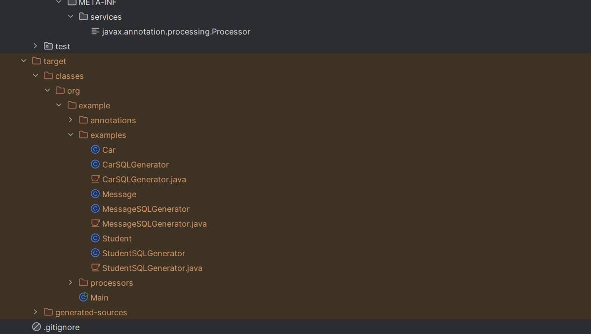
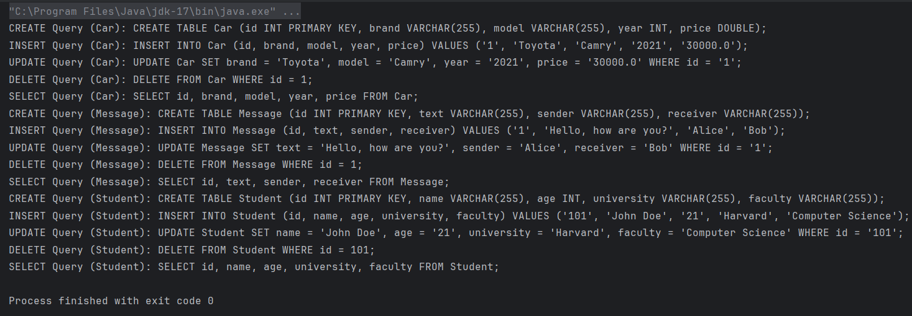

# SQL Generator. Annotation Processors

## Автор

- ІО-25 Величко Максим

## Опис проєкту

Цей проєкт демонструє реалізацію автоматичної генерації SQL-запитів на основі Java-анотацій. Основна ідея полягає у створенні мапінгу між полями Java-об'єктів та колонками таблиць бази даних, що дозволяє автоматизувати створення SQL-запитів для операцій створення (`CREATE`), вставки (`INSERT`), вибірки (`SELECT`), оновлення (`UPDATE`) та видалення (`DELETE`).

## Анотації для мапінгу:

### `@Table`

Використовується для мапінгу Java-класу на таблицю в базі даних. Має параметр name, що вказує назву таблиці.

### `@Column`

мапінгує поле класу на колонку таблиці. Параметр name задає назву колонки.

### `@Id`

Позначає поле, яке є первинним ключем у таблиці.

## Класи-моделі:
- Кожен клас описує сутність бази даних (наприклад, `Car`, `Message`, `Student`).
- Поля класу анотовані для визначення їх відповідності колонкам у таблиці.
- Містять конструктори, геттери та сеттери.

## Генерація SQL-запитів:

- За допомогою процесора анотацій (`SQLAnnotationProcessor`) автоматично створюються класи-генератори для кожної сутності (наприклад, `CarSQLGenerator`).
- Генеруються наступні SQL-запити:
  - `CREATE TABLE`
  - `INSERT INTO`
  - `UPDATE`
  - `DELETE`
  - `SELECT`

## Приклад використання:

- У головному класі Main демонструється робота з генераторами SQL-запитів:
  - Створення об'єктів сутностей (`Car`, `Message`, `Student`).
  - Виклик методів генерації SQL-запитів через класи-генератори (`CarSQLGenerator`, `MessageSQLGenerator`, `StudentSQLGenerator`).
  - Виведення SQL-запитів у консоль.

## Збірка та запуск:

- Вимоги
  - Apache Maven 4.0.0 або вище
  - JDK 17

- Клонуйте репозиторій собі на комп'ютер:

```bash 
git clone https://github.com/makssvelichko/java-advanced-lab3
```


### Збірка проєкту:
- зкомпілювати клас SQLAnnotationProcessor
```bash
javac -d target/classes -sourcepath src/main/java src/main/java/org/example/processors/SQLAnnotationProcessor.java
```
- Наступна команда використовує процесор анотацій SQLAnnotationProcessor під час компіляції Java-класів із пакета org.example.examples

 ```bash
 javac -d target/classes -cp target/classes -processor org.example.processors.SQLAnnotationProcessor -sourcepath src/main/java src/main/java/org/example/examples/*.java
 ```

- Запуск проекту:

  - Запустіть головний клас Main.

## Тестування:

### Після помпіляції в папці `target\classes\org\example\examples` створються `CarSQLGenerator`, `MessageSQLGenerator`, `StudentSQLGenerator`



### Запуск головного класу Main.


